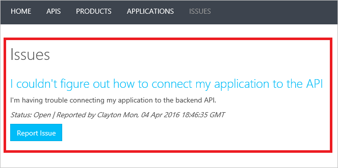

# Issue templates in Azure API Management
Azure API Management provides you the ability to customize the content of developer portal pages using a set of templates that configure their content. Using [DotLiquid](http://dotliquidmarkup.org/) syntax and the editor of your choice, such as [DotLiquid for Designers](https://github.com/dotliquid/dotliquid/wiki/DotLiquid-for-Designers), and a provided set of localized [String resources](../APIManagementTemplates/Azure-API-Management-template-resources.md#strings), [Glyph resources](../APIManagementTemplates/Azure-API-Management-template-resources.md#glyphs), and [Page controls](../APIManagementTemplates/Azure-API-Management-page-controls.md), you have great flexibility to configure the content of the pages as you see fit using these templates.  
  
 The templates in this section allow you to customize the content of the Issue pages in the developer portal.  
  
-   [Issue list](#IssueList)  
  
> [!NOTE]
>  Sample default templates are included in the following documentation, but are subject to change due to continuous improvements. You can view the live default templates in the developer portal by navigating to the desired individual templates. For more information about working with templates, see [How to customize the API Management developer portal using templates](https://azure.microsoft.com/documentation/articles/api-management-developer-portal-templates/).  
  
##  <a name="IssueList"></a> Issue list  
 The **Issue list** template allows you to customize the body of the issue list page in the developer portal.  
  
   
  
### Default template  
  
```xml  
<div class="row">  
  <div class="col-md-9">  
    <h2></h2>  
  </div>  
</div>  
<div class="row">  
  <div class="col-md-12">  
      
    <ul class="list-unstyled">  
        
        
        
        
      <li>  
        <h3>  
          <a href="/issues/{{issue.id}}">{{issue.title}}</a>  
        </h3>  
        <p>{{issue.description}}</p>  
        <em>  
          {{issue.issueState}}  
          {{issue.subscriptionDeveloperName}}  
          {{ reportedBy | replace : replaceString0, state }}  
          {{ str1 | replace : replaceString1, devName }}  
          <span class="UtcDateElement">{{ issue.reportedOn | date: "r" }}</span>  
        </em>  
      </li>  
        
    </ul>  
    <paging-control></paging-control>  
      
      
      
      
    <a class="btn btn-primary" id="createIssue" href="/Issues/Create"></a>  
      
    <hr />  
    <p></p>  
      
    <hr />  
    <p>  
        
      <a href="/signin"></a>  
      {{ signIntext | replace : replaceString0, link }}  
    </p>  
      
  </div>  
</div>  
```  
  
### Controls  
 The `Issue list` template may use the following [page controls](../APIManagementTemplates/Azure-API-Management-page-controls.md).  
  
-   [paging-control](../APIManagementTemplates/Azure-API-Management-page-controls.md#paging-control)  
  
### Data model  
  
|Property|Type|Description|  
|--------------|----------|-----------------|  
|Issues|Collection of [Issue](../APIManagementTemplates/Azure-API-Management-template-data-model-reference.md#Issue) entities.|The issues visible to the current user.|  
|Paging|[Paging](../APIManagementTemplates/Azure-API-Management-template-data-model-reference.md#Paging) entity.|The paging information for the applications collection.|  
|IsAuthenticated|boolean|Whether the current user is signed-in to the developer portal.|  
|CanReportIssues|boolean|Whether the current user has permissions to file an issue.|  
|Search|string|This property is deprecated and should not be used.|  
  
### Sample template data  
  
```json  
{  
    "Issues": [  
        {  
            "Id": "5702b68bb16653124c8f9ba7",  
            "ApiId": "570275f1b16653124c8f9ba3",  
            "Title": "I couldn't figure out how to connect my application to the API",  
            "Description": "I'm having trouble connecting my application to the backend API.",  
            "SubscriptionDeveloperName": "Clayton",  
            "IssueState": "Proposed",  
            "ReportedOn": "2016-04-04T18:46:35.64",  
            "Comments": null,  
            "Attachments": null,  
            "Services": null  
        }  
    ],  
    "Paging": {  
        "Page": 1,  
        "PageSize": 10,  
        "TotalItemCount": 1,  
        "ShowAll": false,  
        "PageCount": 1  
    },  
    "IsAuthenticated": true,  
    "CanReportIssue": true,  
    "Search": null  
}  
```