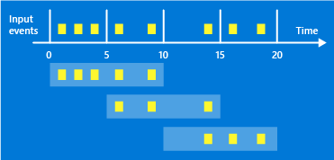

# Hopping Window (Azure Stream Analytics)
  Unlike [tumbling windows](../query-ref/Tumbling-Window--Azure-Stream-Analytics-.md), hopping windows model scheduled overlapping windows. A hopping window specification consist of three parameters: the *timeunit*, the *windowsize* (how long each window lasts) and the *hopsize* (by how much each window moves forward relative to the previous one). Additionally, *offsetsize* may be used as an optional fourth parameter.  Note that a tumbling window is simply a hopping window whose ‘hop’ is equal to its ‘size’.  
  
 The following illustration shows a stream with a series of events. Each box represents a hopping window and the events that are counted as part of that window, assuming that the ‘hop’ is 5, and the ‘size’ is 10.  
  
   
  
 **Syntax**  
  
```  
HOPPINGWINDOW ( timeunit  , windowsize , hopsize, [offsetsize] )   
HOPPINGWINDOW ( Duration( timeunit  , windowsize ) , Hop (timeunit  , windowsize ), [Offset(timeunit  , offsetsize)])  
  
```  
  
> [!NOTE]  
>  The Hopping Window can be used in the above two ways. If the windowsize and the hopsize has the same timeunit, you can use it without the Duration and Hop functions. The Duration function can also be used with other types of windows to specify the window size.  
  
## Arguments  
 **timeunit**  
  
 Is the unit of time for the *windowsize* or the *hopsize*. The following table lists all valid *timeunit* arguments.  
  
|Timeunit|Abbreviations|  
|--------------|-------------------|  
|day|dd, d|  
|hour|hh|  
|minute|mi, n|  
|second|ss, s|  
|millisecond|ms|  
|microsecond|mcs|  
  
 **windowsize**  
  
 A big integer which describes the size of the window.  
  
 The maximum size of the window in all cases is 7 days.  
  
 **hopsize**  
  
 A big integer which describes the size of the Hop  
  
 **offsetsize**  
  
 By default, hopping windows are inclusive in the end of the window and exclusive in the beginning – for example 12:05 PM – 1:05 PM window will include events that happened exactly at 1:05 PM, but will not include events that happened at 12:05:PM (these event will be part of 12:00 PM – 01:00 PM window).    
 The Offset parameter can be used to change behavior and include the events in the beginning of the window and exclude the ones that happened in the end.  
  
## Examples  
  
```  
SELECT System.TimeStamp AS WindowEnd, TollId, COUNT(*)  
FROM Input TIMESTAMP BY EntryTime  
GROUP BY TollId, HoppingWindow(Duration(hour, 1), Hop(minute, 5), Offset(millisecond, -1))  
  
```  
  
  