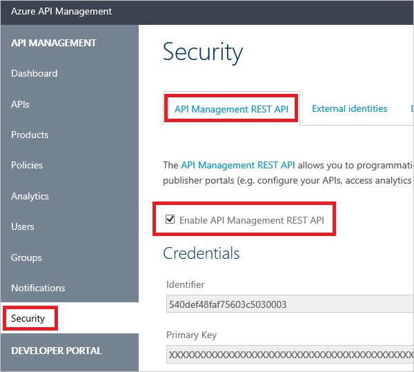
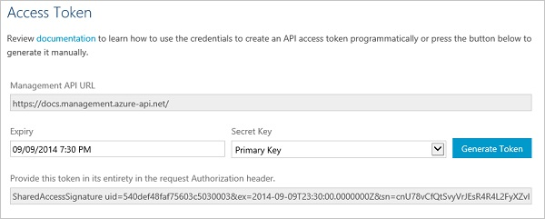

# Azure API Management REST API Authentication
This topic describes how to create the access token required to make calls into the API Management REST API.  
  
> [!NOTE]
>  For more information about authorization and other prerequisites for accessing the API Management REST API, see the [Prerequisites](../rest-conceptual/API-Management-REST.md#Prerequisites) section of the [API Management REST](../rest-conceptual/API-Management-REST.md).  
>   
>  For more information about working with the REST API, see the [API Management .NET REST API Sample](https://github.com/Azure/api-management-samples/tree/master/restApiDemo) and the [Getting Started with Azure API Management REST API](http://azure.microsoft.com/documentation/videos/getting-started-with-azure-api-management-rest-api/) video.  
  
-   [To manually create an access token](../rest-conceptual/Azure-API-Management-REST-API-Authentication.md#ManuallyCreateToken)  
  
-   [To programmatically create an access token](../rest-conceptual/Azure-API-Management-REST-API-Authentication.md#ProgrammaticallyCreateToken)  
  
##  <a name="ManuallyCreateToken"></a> To manually create an access token  
  
1.  Sign into the [Azure Classic Portal](https://manage.windowsazure.com/), navigate to your API Management service instance, and click **Manage** to open the publisher portal.  
  
       
  
2.  Click **Security** in the **API Management** section of the left navigation menu, select the **API Management REST API** tab, and ensure that the **Enable API Management REST API** checkbox is checked.  
  
    > [!IMPORTANT]
    >  If the **Enable API Management REST API** checkbox is not checked, calls made to the REST API for that service instance will fail.  
  
       
  
3.  Specify the expiration date and time for the access token in the **Expiry** text box. This value must be in the format `MM/DD/YYYY H:MM PM|AM`.  
  
       
  
4.  Select either the primary key or secondary key in the **Secret Key** drop-down list. The keys provide equivalent access; two keys are provided to enable flexible key management strategies.  
  
5.  Click **Generate Token** to create the access token.  
  
6.  Copy the full access token and provide it in the `Authorization` header of every request to the API Management REST API, as shown in the following example.  
  
    ```  
    Authorization: SharedAccessSignature uid=53dd860e1b72ff0467030003&ex=2014-08-04T22:03:00.0000000Z&sn=ItH6scUyCazNKHULKA0Yv6T+Skk4bdVmLqcPPPdWoxl2n1+rVbhKlplFrqjkoUFRr0og4wjeDz4yfThC82OjfQ==  
    ```  
  
##  <a name="ProgrammaticallyCreateToken"></a> To programmatically create an access token  
  
1.  Construct a string-to-sign in the following format, where `identifier` is the value from the **Identifier** text box in the **Credentials** section of the **Service Management API** tab of **System Settings**, and `expiry` is the value of the **Expiry** text box in the **Access Token** section.  
  
     `{identifier} + "\n" + {expiry}`  
  
    > [!NOTE]
    >  To access the settings described in this step, sign into the API Management publisher portal as described in the previous [To manually create an access token](#ManuallyCreateToken) section.  
  
2.  Generate a signature by applying an HMAC-SHA512 hash function to the string-to-sign using either the primary or secondary key.  
  
3.  Base64 encode the returned signature key.  
  
4.  Create an access token using the following format.  
  
     `uid={identifier}&ex={expiry}&sn={Base64 encoded signature}`  
  
    ```  
    uid=53dd860e1b72ff0467030003&ex=2014-08-04T22:03:00.0000000Z&sn=ItH6scUyCazNKHULKA0Yv6T+Skk4bdVmLqcPPPdWoxl2n1+rVbhKlplFrqjkoUFRr0og4wjeDz4yfThC82OjfQ==  
    ```  
  
5.  Use these values to create an `Authorization` header in every request to the API Management REST API, as shown in the following example.  
  
    ```  
    Authorizaton: SharedAccessSignature uid=53dd860e1b72ff0467030003&ex=2014-08-04T22:03:00.0000000Z&sn=ItH6scUyCazNKHULKA0Yv6T+Skk4bdVmLqcPPPdWoxl2n1+rVbhKlplFrqjkoUFRr0og4wjeDz4yfThC82OjfQ==  
    ```  
  
 The following example demonstrates the preceding steps for generating the access token.  
  
```c#  
using System;   
using System.Text;   
using System.Globalization;   
using System.Security.Cryptography;   
  
public class Program   
{   
    public static void Main()   
    {   
        var id = "53d7e14aee681a0034030003";   
        var key = "pXeTVcmdbU9XxH6fPcPlq8Y9D9G3Cdo5Eh2nMSgKj/DWqeSFFXDdmpz5Trv+L2hQNM+nGa704Rf8Z22W9O1jdQ==";   
        var expiry = DateTime.UtcNow.AddDays(10);   
        using (var encoder = new HMACSHA512(Encoding.UTF8.GetBytes(key)))   
        {   
            var dataToSign = id + "\n" + expiry.ToString("O", CultureInfo.InvariantCulture);   
            var hash = encoder.ComputeHash(Encoding.UTF8.GetBytes(dataToSign));   
            var signature = Convert.ToBase64String(hash);   
            var encodedToken = string.Format("SharedAccessSignature uid={0}&ex={1:o}&sn={2}", id, expiry, signature);   
            Console.WriteLine(encodedToken);   
        }   
    }   
}  
  
```  
  
 For complete sample code, see the [API Management .NET REST API Sample](https://github.com/Azure/api-management-samples/tree/master/restApiDemo).  
  
## See Also  
 [API Management Policy](../templates/Azure-API-Management-Policies.md)   
 [API Management REST](../rest-conceptual/API-Management-REST.md)